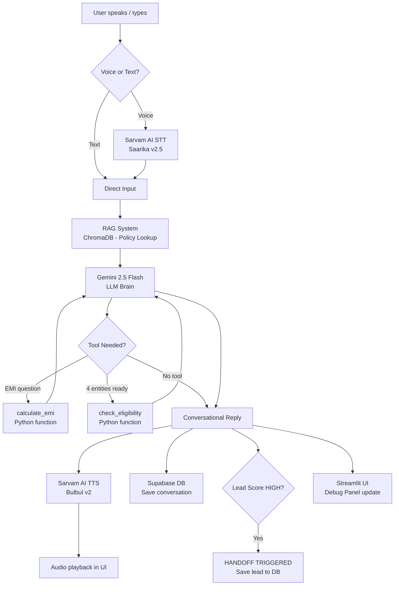

# 🏠 Vernacular Loan Counselor — HomeFirst Finance

A voice-first AI agent that provides home loan counseling in Hindi, English, Marathi, and Tamil.
Built with **Google Gemini 2.5 Flash** (free tier), **Sarvam AI** (free credits), and **Supabase** (free tier).

---

## 🆓 Free APIs Used

| Service | Purpose |
|---|---|
| **Google Gemini 2.5 Flash** | LLM Brain (language lock, entity extraction, tool calling) |
| **Sarvam AI** | STT (Saarika v2.5) + TTS (Bulbul v2) for Indian languages |
| **Supabase** | PostgreSQL database for conversations & leads |
| **ChromaDB** | Local vector DB for RAG (no API needed) |

---

## 📁 Project Structure

```
vernacular_loan_counselor/
├── app.py                  ← Streamlit frontend (main entry point)
├── requirements.txt        ← Python dependencies
├── .env.example            ← Copy to .env and fill in your API keys
├── backend/
│   ├── llm_brain.py        ← Gemini LLM orchestration + language lock
│   ├── tools.py            ← Deterministic EMI & eligibility calculator
│   ├── voice.py            ← Sarvam AI STT + TTS
│   ├── rag.py              ← ChromaDB vector DB with HomeFirst FAQs
│   └── database.py         ← Supabase client for persistence
└── README.md
```

---

## 🚀 Setup Instructions (Step-by-Step for Beginners)

### Step 1 — Install Python
Download and install Python 3.11 or newer from https://python.org/downloads
During installation, **check the box that says "Add Python to PATH"**.

### Step 2 — Download the Project
Save all the project files into a folder, e.g., `vernacular_loan_counselor/`

### Step 3 — Open Terminal / Command Prompt
- **Windows**: Press `Win + R`, type `cmd`, press Enter
- **Mac**: Press `Cmd + Space`, type `Terminal`, press Enter

Navigate to your project folder:
```bash
cd path/to/vernacular_loan_counselor
```

### Step 4 — Create a Virtual Environment (Recommended)
```bash
python -m venv venv

# Activate it:
# Windows:
venv\Scripts\activate

# Mac/Linux:
source venv/bin/activate
```
You should see `(venv)` at the start of your terminal prompt.

### Step 5 — Install Dependencies
```bash
pip install -r requirements.txt
```
This installs all required packages. It may take 3–5 minutes.

### Step 6 — Get Your Free API Keys

#### 6a. Google Gemini API Key (FREE)
1. Go to https://aistudio.google.com
2. Sign in with your Google account
3. Click **"Get API Key"** → **"Create API key"**
4. Copy the key (looks like `AIzaSy...`)

#### 6b. Sarvam AI API Key (FREE ₹1,000 credits)
1. Go to https://dashboard.sarvam.ai
2. Sign up with your email
3. Go to **Settings → API Keys** → Create a new key
4. Copy the key

#### 6c. Supabase (FREE database)
1. Go to https://supabase.com → **"Start your project"**
2. Create a new project (choose any region)
3. Go to **Settings → API**
4. Copy:
   - **Project URL** (looks like `https://abcxyz.supabase.co`)
   - **Anon public key** (long string starting with `eyJ...`)
5. Go to **SQL Editor** in Supabase, paste and run this SQL:

```sql
CREATE TABLE IF NOT EXISTS conversations (
    id          BIGSERIAL PRIMARY KEY,
    session_id  TEXT NOT NULL,
    role        TEXT NOT NULL,
    message     TEXT NOT NULL,
    language    TEXT DEFAULT 'hindi',
    created_at  TIMESTAMPTZ DEFAULT NOW()
);

CREATE TABLE IF NOT EXISTS leads (
    id                  BIGSERIAL PRIMARY KEY,
    session_id          TEXT NOT NULL,
    monthly_income      NUMERIC,
    property_value      NUMERIC,
    loan_requested      NUMERIC,
    approved_amount     NUMERIC,
    employment_status   TEXT,
    emi                 NUMERIC,
    lead_score          TEXT,
    language            TEXT,
    handoff_triggered   BOOLEAN DEFAULT FALSE,
    created_at          TIMESTAMPTZ DEFAULT NOW()
);
```

### Step 7 — Configure Environment Variables
```bash
# Copy the example file
cp .env.example .env
```
Open `.env` in any text editor (Notepad, VS Code, etc.) and fill in your keys:
```
GEMINI_API_KEY=AIzaSy...your_key...
SARVAM_API_KEY=your_sarvam_key
SUPABASE_URL=https://your-project.supabase.co
SUPABASE_KEY=eyJ...your_anon_key...
```

### Step 8 — Run the App
```bash
streamlit run app.py
```
A browser window will automatically open at `http://localhost:8501` 🎉

---

## 🎯 How to Use

1. **Click "Start Conversation"** — the bot will greet you in Hindi
2. **Speak or type** in Hindi, English, Marathi, or Tamil
3. The bot will **lock to your first language** and stay in it
4. Provide your: monthly income → property value → loan amount → employment type
5. The bot will **call the eligibility tool** and show results in the Debug Panel
6. If eligible with high intent, the **[HANDOFF TRIGGERED]** banner will appear
7. For voice: click the microphone 🎙️, speak, and the bot responds with audio

---

## 🧠 Core System Prompt

```
You are "Vaani", a friendly and professional Home Loan Counselor for HomeFirst Finance India.

LANGUAGE LOCK — CRITICAL RULE:
[Dynamically injected based on detected language]
You MUST respond ONLY in the locked language for ALL messages.

ENTITY EXTRACTION:
As you converse, extract: monthly_income, property_value, loan_amount_requested, employment_status.

TOOL CALLING RULES:
- NEVER do math yourself. ALWAYS use tools.
- Use calculate_emi when user asks about monthly payments.
- Use check_eligibility ONLY when you have ALL FOUR entities.

OUT-OF-DOMAIN HANDLING:
If asked about personal loans, car loans, or unrelated topics:
"I specialise only in home loans. How can I help you with a home loan today?"

HANDOFF TRIGGER:
If eligibility confirmed and lead_score is HIGH, end with:
[HANDOFF TRIGGERED: Routing to Human RM]
```

---

## 🏗️ Architecture & Flow Diagram



---

## ⚠️ Self-Identified Architectural Issues

1. **Synchronous STT bottleneck**: The `transcribe_audio()` call in `voice.py` is a blocking HTTP request. In production, this should be an async WebSocket stream to reduce perceived latency from ~2–3s to under 500ms.

2. **Context window overflow**: After ~20 turns, the full conversation history passed to Gemini will approach token limits. A production system needs summarization or a sliding window approach to compress old turns.

3. **No streaming responses**: The TTS is called only after the full LLM response is generated. A streaming pipeline (LLM token stream → TTS chunk stream) would feel much more natural.

4. **Language detection brittleness**: The language lock uses a single Gemini call on the first utterance. Very short first messages ("Hi") can misclassify. A better approach would average detection over the first 2–3 turns.

5. **No audio chunking for TTS**: Sarvam TTS has a ~500 character limit per call. Long responses are truncated in the current implementation. Production code should split on sentence boundaries and stream chunks.

6. **Single-tenant RAG**: ChromaDB is in-memory and resets on server restart. For production, use a persistent ChromaDB or Pinecone with proper document versioning.

---

## 🤖 AI Code Review (Self-Conducted via Claude)

**Score: 6.5 / 10**

> "The architecture correctly separates concerns (Brain, Voice, Tools, RAG, DB) and the deterministic tool approach wisely prevents LLM arithmetic errors. The language-lock mechanism is implemented thoughtfully with a dedicated detection step. However, the synchronous voice pipeline creates a significant UX bottleneck, and the context management is naive—appending raw history without summarization will break at scale. The Supabase integration lacks error recovery and retry logic. The RAG implementation using ChromaDB's default embeddings is acceptable for a prototype but will suffer recall quality on mixed-language queries. No unit tests exist for the critical `check_eligibility` and `calculate_emi` functions. The Streamlit UI works but will not scale beyond 1 concurrent user."

---

## 🔮 Future Improvements

### Technical
- Replace blocking STT/TTS with WebSocket streaming (Sarvam supports this) for sub-500ms latency
- Add async pipeline with Python `asyncio` so UI stays responsive during model calls
- Implement conversation summarization to handle sessions beyond 20 turns
- Add a retry queue with exponential backoff for all API calls
- Write pytest unit tests for all tool functions with edge cases
- Add Redis for session caching to support multiple concurrent users
- Deploy on Railway or Render (free tier) with proper secrets management

### Functional / Business
- Integrate real credit score check via CIBIL API for accurate eligibility
- Add document upload (Aadhaar, salary slip) with Gemini vision for auto-parsing
- Build a supervisor dashboard in Supabase showing all leads in real-time
- Add WhatsApp integration via Twilio so customers can use their phone naturally
- Train a fine-tuned Sarvam STT model on loan-domain vocabulary (EMI, FOIR, LTV)
- Add multi-language FAQ expansion — Gujarati, Bengali, Kannada
